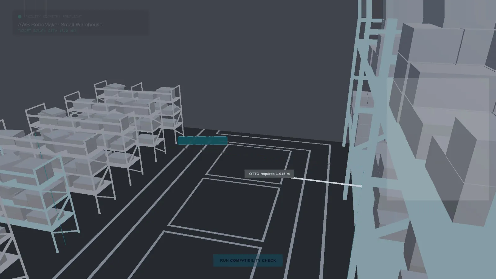
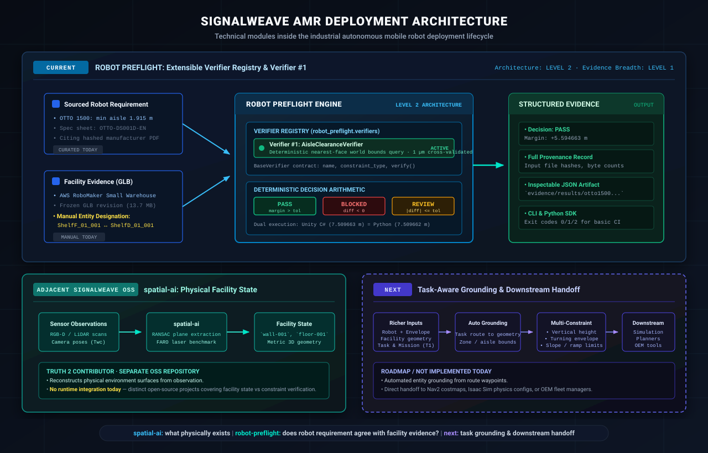

# Robot Preflight

Preflight robot deployments before simulation and commissioning.

Robot Preflight turns robot requirements, facility evidence, and deployment
context into grounded constraints that can be checked before downstream
engineering begins.

Today, one verifier is fully evidenced end to end:

**OTTO 1500 selected-span aisle clearance (Verifier #1).**



## Verifier #1 — Aisle Clearance (Verified Reference Example)

| Evidence | Value |
|---|---|
| Robot | OTTO 1500 |
| Constraint | Minimum one-way aisle width |
| Required | 1.915 m |
| Measured (Unity PlayMode) | 7.509663 m |
| Margin | +5.594663 m |
| Decision | **PASS** |
| Requirement source | OTTO 1500 manufacturer spec sheet, doc `OTTO-DS001D-EN-APR2024`, p.1 |
| Facility source | AWS RoboMaker Small Warehouse World (independently sourced, frozen revision) |
| Verification | Unity Play Mode + independent offline Python recomputation |
| Agreement | within 1 µm |

The requirement comes from the OTTO manufacturer specification. The
facility geometry comes from an independently sourced AWS RoboMaker
warehouse environment — not a warehouse built to pass. The measurement is
deterministic and was independently reproduced outside the main Unity
execution path. The two computations agree to within 1 micrometer.

[Run the example](#quickstart) · [Inspect the evidence](#dont-trust-the-screenshot-reproduce-it) · [See the architecture](#architecture) · [Current Capabilities Audit](docs/current-capabilities.md)

---

## Where Robot Preflight Fits in AMR Deployment

Deploying an autonomous mobile robot (AMR) into an active facility spans
multiple stages: mission definition, facility representation, robot definition,
feasibility and simulation, detailed deployment design, site preparation, OEM
fleet configuration, and commissioning.

Robot Preflight conceptually sits **between initial definition (Stages 1–3) and
downstream simulation/commissioning (Stages 4+)**:

```
Stage 1: Mission Definition
Stage 2: Facility Representation
Stage 3: Robot & Envelope Definition
                 │
                 ▼
      [ ROBOT PREFLIGHT ]
      • Sourced requirement extraction
      • Spatial entity grounding (manual today)
      • Deterministic verifiers (Verifier #1: aisle clearance)
      • PASS / BLOCKED / REVIEW decision
                 │
                 ▼
      Verified Constraints
                 │
                 ▼ (can feed / future handoff)
Existing downstream tools: Simulation · OEM Fleet Manager · Planners · Commissioning
```

Robot Preflight does **not** replace physics simulation, fleet managers (e.g.
OTTO Fleet Manager, MiR Fleet), navigation planners (Nav2), or physical
commissioning. Its job is to catch physical and spatial conflicts *before*
those downstream tools are configured.

See [`docs/workflow-context.md`](docs/workflow-context.md) for the complete
12-stage deployment lifecycle.

---

## The Core Value: Why This Exists

A geometry library can calculate the distance between two 3D meshes.
**Robot Preflight preserves why that distance matters:**

* **Which robot requirement it came from** — with citations to hashed manufacturer PDFs.
* **Which deployment configuration it applies to** — nominal model, attachments, and operating mode.
* **Which facility entities were measured** — exact node IDs from the facility spatial model.
* **How they were measured** — axis, bounding hulls, and declared tolerances.
* **Explicit decision status** — whether the requirement clearly passes, blocks, or requires review.
* **Inspectable audit trail** — deterministic reproduction independent of UI rendering.

---

## Realistic User Flow Today

1. **Cite Robot Requirement**: Sourced from manufacturer documentation (e.g. `otto_1500` one-way aisle width).
2. **Provide Facility Geometry**: A standard binary glTF 2.0 (`.glb`) facility model.
3. **Declare Deployment Parameters**: Coordinate axis (`X`, `Y`, or `Z`) and measurement tolerance (`tolerance_m`).
4. **Designate Boundary Entities**: *(Manual today)* The user designates the two facility entity nodes (`entity_a` and `entity_b`) that define the critical span. Automated route/zone grounding is roadmap.
5. **Run Preflight**: Run via the CLI (`robot-preflight check <dir>`) or Python SDK (`Preflight.check(...)`).
6. **Evaluate Decision**: System returns `PASS`, `BLOCKED`, or `REVIEW` with an exact signed clearance margin.
7. **Export Evidence Artifact**: Emits a structured JSON result suitable for CI gating or engineering review.

---

## Deployment Constraint Model

Each preflight check is defined by a structured deployment contract. Below is the
actual schema used for the verified reference example (`examples/otto1500_warehouse/config.yaml`):

```yaml
robot:
  id: otto_1500

facility:
  geometry: Assets/StreamingAssets/WarehouseGeometry/aws_independent_warehouse.glb
  source: >-
    AWS RoboMaker Small Warehouse World (aws-robotics/aws-robomaker-small-warehouse-world,
    frozen revision 3c23a698bf0b4e366ddf8b084af507c519bd3483, MIT-0)

constraint:
  type: aisle_clearance
  required_m: 1.915
  tolerance_m: 0.005

measurement:
  axis: X
  entity_a: aws_robomaker_warehouse_ShelfF_01_001
  entity_b: aws_robomaker_warehouse_ShelfD_01_001
  method: >-
    Nearest-face world-space gap between the two named entities' combined
    renderer bounds along the X axis, clamped at 0.
```

> [!NOTE]
> **Manual Grounding Boundary**: Today, the user explicitly designates `entity_a` and `entity_b`.
> Automatic grounding from route waypoints or semantic zone definitions to facility
> geometry is roadmap.

---

## Decision Vocabulary

Robot Preflight implements a three-state deterministic decision model:

* **`PASS`** — The measured clearance clearly satisfies the requirement with positive margin: `available - required > tolerance`.
* **`BLOCKED`** — The measured clearance clearly violates the requirement: `available - required < -tolerance` (or `difference < 0`).
* **`REVIEW`** — The measurement difference falls within the declared uncertainty tolerance (`|available - required| <= tolerance`), or geometry evidence is ambiguous, preventing a deterministic automated decision.

Both Python and C# engines implement identical decision arithmetic, verified in unit tests.

---

## Architecture



Robot Preflight sits between robot requirements and facility geometry.
Physical measurements come from explicit geometry. Compatibility decisions remain
deterministic and inspectable:

* **Verifier Registry** (`robot_preflight.verifiers`): An extensible registry mapping constraint types to dedicated verification implementations.
* **Verifier #1** (`AisleClearanceVerifier`): The initial active verifier, executing nearest-face world-space bounds queries on glTF node trees.
* **Dual Execution**: The same glTF bounds computation exists in Unity (`AisleClearanceChecker.cs`) and in pure Python (`validate_independent_warehouse_glb.py`), allowing independent cross-validation.

Deeper detail: [`docs/architecture.md`](docs/architecture.md).

---

## Demo Video

<video src="media/demo/robot_preflight.mp4" controls muted playsinline poster="media/hero/robot_preflight_hero_poster.png" width="720"></video>

If the player above doesn't render: [`media/demo/robot_preflight.mp4`](media/demo/robot_preflight.mp4) (21 s, 2.2 MB, understandable muted).

This video is supporting evidence, not the proof — the reproducible computation
below is the actual verification artifact.

---

## Quickstart

### Install

```bash
pip install -e .
```

Requires Python 3.9+ and `PyYAML>=6.0`. No heavy ML frameworks or external graphics runtimes required for CLI verification.

### Run the CLI

```bash
robot-preflight check examples/otto1500_warehouse
```

Expected output:

```text
Robot Preflight

Robot        otto_1500
Constraint   aisle_clearance

Required     1.915000 m
Available    7.509662 m
Margin       +5.594662 m

Decision     PASS

Requirement source
OTTO 1500 Spec Sheet, doc OTTO-DS001D-EN-APR2024, p.1: 'Min. Aisle Width 1915 mm (78 in) (One Way)'. See evidence/requirements/otto/OTTO_EVIDENCE_RECORD.md.

Facility source
AWS RoboMaker Small Warehouse World (aws-robotics/aws-robomaker-small-warehouse-world, frozen revision 3c23a698bf0b4e366ddf8b084af507c519bd3483, MIT-0)

Verification
Deterministic geometry: nearest-face world-space gap between the two named entities' renderer bounds along the configured axis, computed by re-parsing the facility .glb (Tools/WarehouseGeometry/validate_independent_warehouse_glb.py:inspect, invoked directly by this module -- not a stored value).
```

### JSON Output for CI/CD

```bash
robot-preflight check examples/otto1500_warehouse --json
```

Exit codes:
* `0`: PASS
* `1`: BLOCKED or REVIEW (fails CI gate)
* `2`: Execution error (missing entity, invalid YAML, corrupt GLB)

### Python SDK

```python
from robot_preflight import Preflight

result = Preflight.check(
    robot="otto_1500",
    facility="examples/otto1500_warehouse",
    constraint="aisle_clearance",
)

assert result.decision == "PASS"
print(f"Margin: {result.margin_m:+.6f} m")
```

---

## Don't trust the screenshot. Reproduce it.

Every claim in this repository is reproducible from source:

```bash
make test    # Runs full unit test suite (8 tests)
make verify  # Verifies hashes, determinism, and 1 µm numeric agreement
```

### Verification Artifacts on Disk

1. **Frozen Result**: [`evidence/results/otto1500_warehouse.json`](evidence/results/otto1500_warehouse.json) — Full run record with hashes.
2. **Manufacturer Spec Sheet**: [`evidence/requirements/otto/`](evidence/requirements/otto/) — Hashed manufacturer PDF and page-1 crop.
3. **Preregistration Record**: [`evidence/environments/warehouse_measurement_preregistration.md`](evidence/environments/warehouse_measurement_preregistration.md) — Pre-run entity selection record.
4. **Current Capabilities Audit**: [`docs/current-capabilities.md`](docs/current-capabilities.md) — Comprehensive capability matrix.

---

## What This Proves and What It Does Not

### Proven by Evidence Today
* One robot requirement and one independent facility geometry reconciled end-to-end.
* Independent cross-validation between Unity 6 and pure Python agreeing within 1 µm.
* Extensible verifier architecture with Verifier #1 operational.

### Not Supported Today (Roadmap)
* Automated CAD/IFC or 2D floorplan ingestion (GLB only today).
* Automated entity grounding (requires explicit node names today).
* Route, waypoint, or operational mission context.
* Automated generation of Nav2 costmaps or OEM fleet configurations.
* Whole-facility safety certification (ISO 3691-4 / ANSI R15.08).

See [`docs/limitations.md`](docs/limitations.md) and [`docs/current-capabilities.md`](docs/current-capabilities.md).

---

## Documentation

* [`docs/current-capabilities.md`](docs/current-capabilities.md) — Capability matrix and code audit.
* [`docs/workflow-context.md`](docs/workflow-context.md) — Where Robot Preflight sits in the 12-stage AMR lifecycle.
* [`docs/architecture.md`](docs/architecture.md) — Internal architecture and Unity implementation details.
* [`docs/verification.md`](docs/verification.md) — Independent cross-validation methodology.
* [`docs/geometry-validation.md`](docs/geometry-validation.md) — Geometry pipeline analysis and GO/NO-GO criteria.
* [`docs/unity-development.md`](docs/unity-development.md) — Unity development and batchmode test reproduction.

---

## License

Licensed under the [Apache License, Version 2.0](LICENSE).
